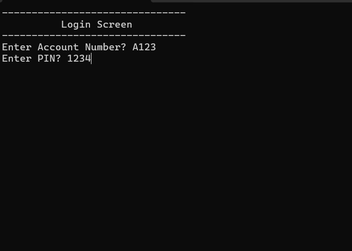
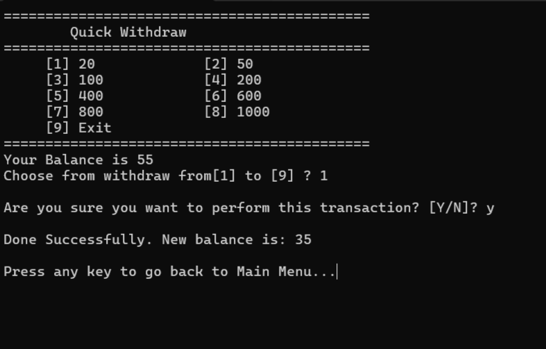
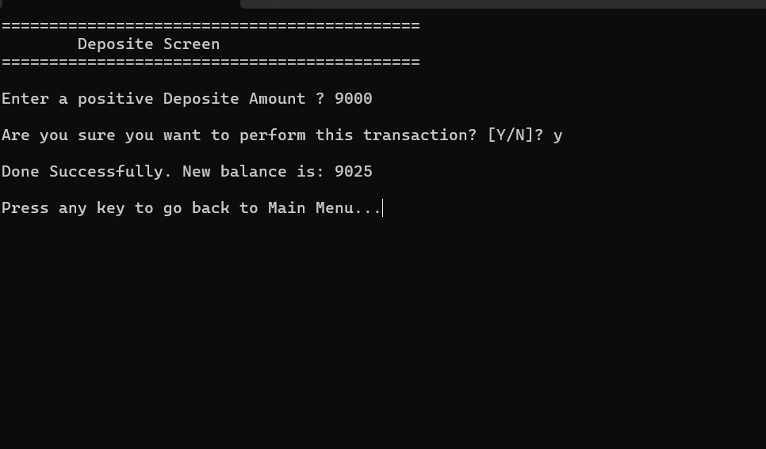
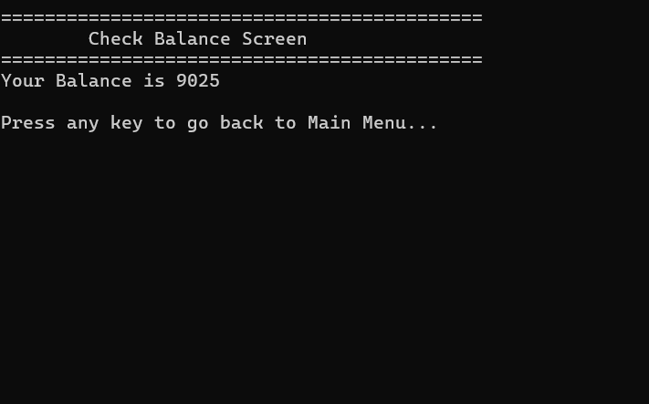
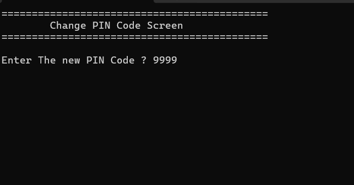
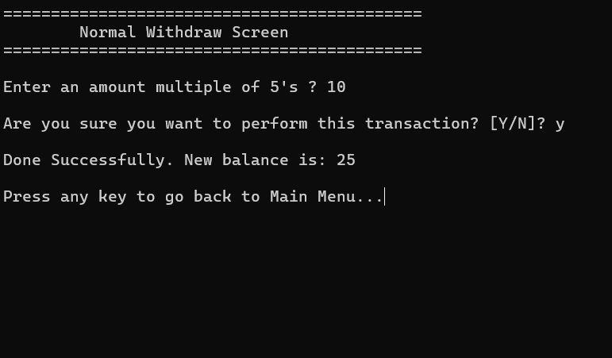

# 🏧 C++ ATM System — Console Banking Simulation
This project is a fully functional **ATM system** built in C++ that mimics real-world banking operations. It offers a simple, user-friendly console interface for managing customer accounts with persistent storage.

---
## 🧰 Features
- 🔐 **User Login System** (with PIN verification)
- 💸 **Quick Withdraw** (preset amounts like 20, 50, 100, etc.)
- 💰 **Normal Withdraw** (custom amounts in multiples of 5)
- 🏦 **Deposit Funds**
- 📊 **Check Account Balance**
- 🔁 **Change PIN Code**
- 💾 **Persistent Data Storage** using file handling
---
## 📸 Screenshots

  
🔐 Login Screen

  

  
💸 Quick Withdraw

  

  
🏦 Deposit Screen

  

  
📊 Balance Check

  

  
🔁 Change PIN Code

  

  
💵 Normal Withdraw

  

